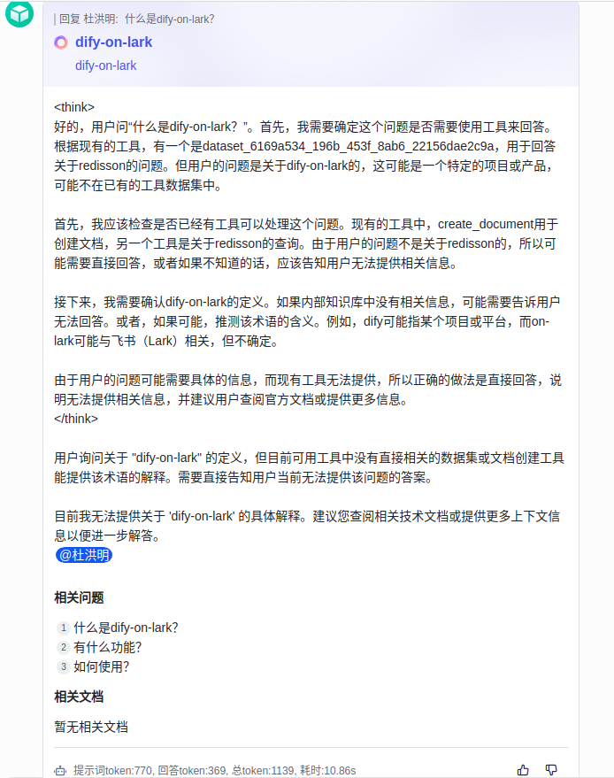
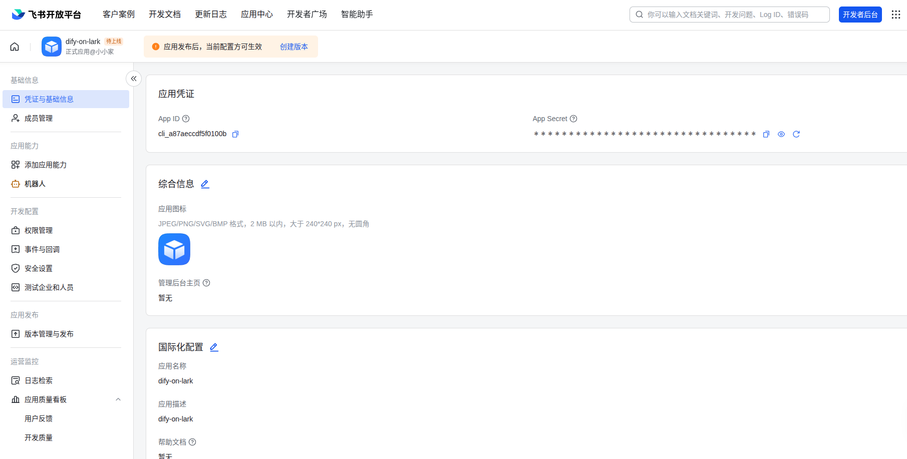
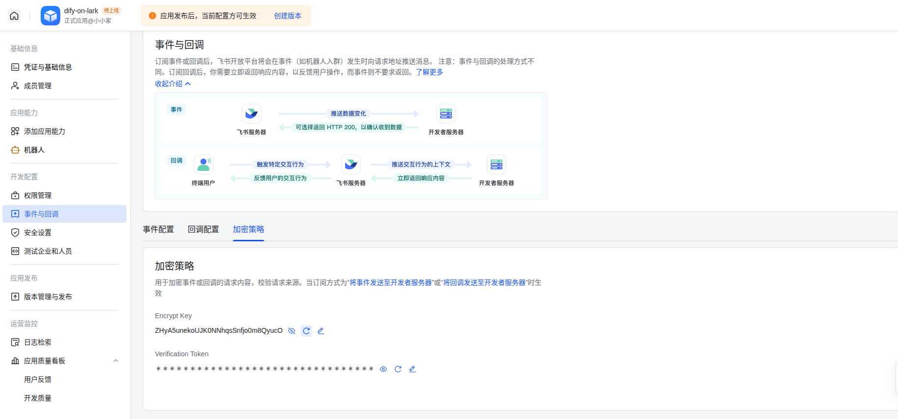
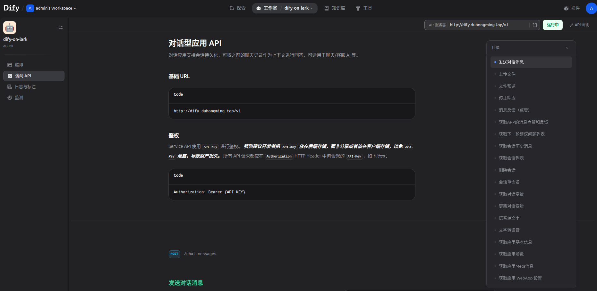
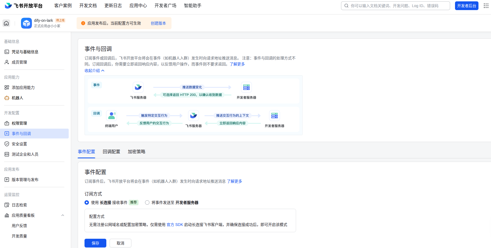
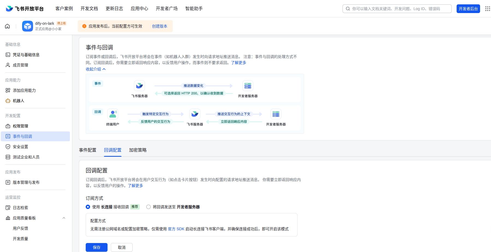
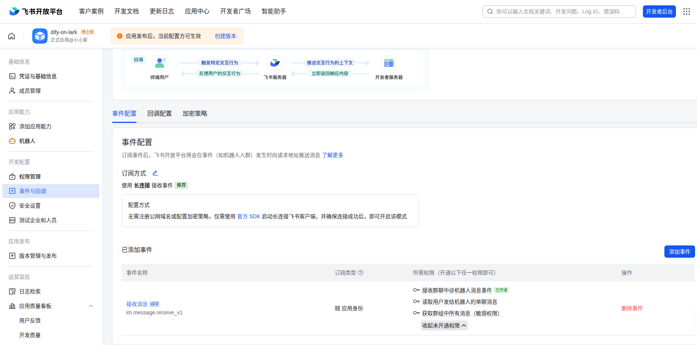
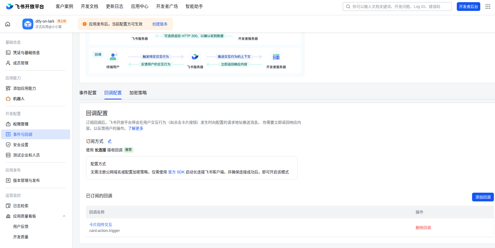
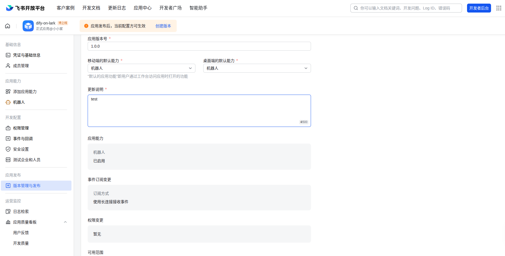
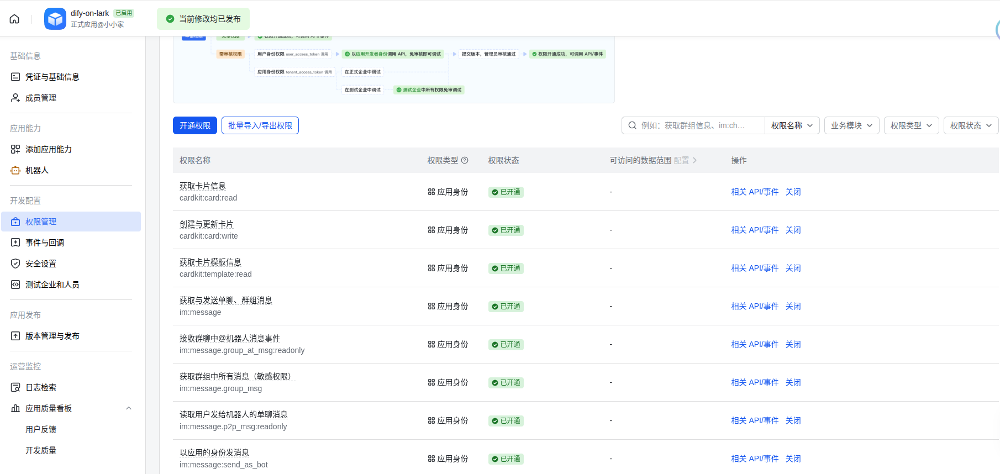

<div align="center">

[English](README_EN.md) / 简体中文 / (PR for your language)

[](https://github.com/duhongming1990/dify-on-lark/releases/latest)


</div>

# 1 介绍

dify-on-lark是一个非常轻量级、易于部署 Dify
的飞书机器人集成方案。可以通过简单配置来对接你的Dify应用和企业内部机器人，实现企业内部机器人的群聊、私聊智能问答，且支持飞书的AI卡片流式打字机输出效果。

## 1.1 项目功能

- 支持回复卡片消息
- 支持显示Dify中应用名称和应用描述
- 支持卡片流式响应推理输出
- 支持@相关人员
- 支持相关问题显示
- 支持相关文档显示
- 支持token用量分析和推理耗时
- 支持点赞和踩功能和Dify后台交互



## 1.2 项目背景

### 1.2.1 参考dify-on-dingtalk

- 将 Dify 应用与钉钉机器人集成：https://docs.dify.ai/zh-hans/learn-more/use-cases/dify-on-dingtalk
- GitHub：https://github.com/zfanswer/dify-on-dingtalk

### 1.2.2 参考dify-on-wechat

- 手把手教你把 Dify 接入微信生态：https://docs.dify.ai/zh-hans/learn-more/use-cases/dify-on-wechat
- GitHub：https://github.com/hanfangyuan4396/dify-on-wechat

### 1.2.3 参考langbot

- 将 Dify 快速接入
  QQ、微信、飞书、钉钉等平台：https://docs.dify.ai/zh-hans/learn-more/use-cases/connect-dify-to-various-im-platforms-by-using-langbot
- GitHub：https://github.com/langbot-app/LangBot

发现没有专门对接飞书的dify-on-lark，langbot中可以接入飞书，但发现只是基础功能：卡片流式响应推理输出。

## 1.3 项目依赖

- 依赖飞书SDK：https://github.com/larksuite/oapi-sdk-java

- 依赖Dify SDK：https://github.com/imfangs/dify-java-client

# 2 项目配置及部署

| 配置参数                            | 是否必填 | 备注                                                                                          |
|---------------------------------|------|---------------------------------------------------------------------------------------------|
| platform.lark.appId             | ✅    | 应用唯一的 ID 标识                                                                                 |
| platform.lark.appSecret         | ✅    | 应用的密钥，在创建应用时由平台生成，可用于获取 app_access_token                                                    |
| platform.lark.verificationToken | ✅    | 用于加密事件或回调的请求内容，校验请求来源。当订阅方式为“将事件发送至开发者服务器”或“将回调发送至开发者服务器”时生效                                |
| platform.lark.encryptKey        | ✅    | 用于加密事件或回调的请求内容，校验请求来源。当订阅方式为“将事件发送至开发者服务器”或“将回调发送至开发者服务器”时生效                                |
| platform.lark.cardTemplateId    |      | 如果配置中cardTemplateId不存在，则使用内置Card。可自定义卡片，先将[LLM.card](src/main/resources/LLM.card)导入进去，自行修改！ |
| provider.dify.url               | ✅    | Dify地址，需要带上/v1，例如：http://localhost/v1                                                       |
| provider.dify.auth              | ✅    | Dify鉴权，无需加上Bearer ,例如：app-xxx                                                               |                                               

## 2.1 飞书配置

https://open.feishu.cn/app

### 2.1.1 获取appId和appSecret



```properties
platform.lark.appId=xxx
platform.lark.appSecret=xxx
```

### 2.1.2 获取verificationToken和encryptKey



```properties
platform.lark.verificationToken=xxx
platform.lark.encryptKey=xxx
```

### 2.1.3 飞书卡片配置（可选）

https://open.feishu.cn/cardkit
可自定义卡片，先将[LLM.card](src/main/resources/LLM.card)导入进去，自行修改！

```
platform.lark.cardTemplateId=xxx
```

需要新建这几个变量

- name 应用名称
- description 应用描述
- answer 回答
- question 相关问题
- document 相关文档

## 2.2 Dify配置



```properties
provider.dify.url=http://localhost/v1
provider.dify.auth=app-xxx
```

## 2.3 启动服务

### 2.3.1 利用Docker启动服务

```bash
docker run -d --name dify-on-lark \
  -e TZ=Asia/Shanghai \
  -e PARAMS="--platform.lark.appId=xxx \
  --platform.lark.appSecret=xxx \
  --platform.lark.encryptKey=xxx \
  --platform.lark.verificationToken=xxx \
  --provider.dify.url=http://localhost/v1 \
  --provider.dify.auth=app-xxx" \
  -p 8088:8088 \
  --restart=always \
duhongming/dify-on-lark:v1.0.0 
```

### 2.3.2 从源码启动服务

重命名文件，填入配置即可！

```bash
mv application.template.properties application.properties
```

run `DifyOnLarkApplication`就行了！

### 2.3.3 k8s启动
一键执行：
```bash
kubectl apply -f dify-on-lark.yaml
```

dify-on-lark.yaml 如下：
```yaml
apiVersion: apps/v1
kind: Deployment
metadata:
  name: dify-on-lark  # 对应 --name dify-on-lark
  labels:
    app: dify-on-lark
spec:
  replicas: 1
  selector:
    matchLabels:
      app: dify-on-lark
  template:
    metadata:
      labels:
        app: dify-on-lark
    spec:
      containers:
      - name: dify-on-lark  # 容器名称与部署名保持一致
        image: duhongming/dify-on-lark:v1.0.1  # 镜像地址
        env:
        - name: TZ
          value: "Asia/Shanghai"  # 时区环境变量
        - name: PARAMS
          value: |  # 保留原参数结构，换行保持可读性
            --platform.lark.appId=xxx
            --platform.lark.appSecret=xxx
            --platform.lark.encryptKey=xxx
            --platform.lark.verificationToken=xxx
            --provider.dify.url=http://localhost/v1
            --provider.dify.auth=app-xxx
        ports:
        - containerPort: 8088  # 假设应用默认暴露8080端口（请根据实际端口调整）
---
apiVersion: v1
kind: Service
metadata:
  name: dify-on-lark-service  # Service名称与部署名关联
spec:
  selector:
    app: dify-on-lark  # 关联到上面的Deployment
  ports:
  - port: 8088  # Service暴露的集群内访问端口
    targetPort: 8088  # 映射到容器的端口（需与containerPort一致）
  type: ClusterIP  # 集群内部可访问，如需外部访问可改为NodePort/LoadBalancer
---
# https://doc.traefik.io/traefik/reference/routing-configuration/kubernetes/crd/http/ingressroute/ 
apiVersion: traefik.io/v1alpha1
kind: IngressRoute
metadata:
  name: dify-on-lark-ingress-route-http
spec:
  entryPoints:
  - web
  routes:
  - match: Host(`dify-on-lark.example.com`) 
    kind: Rule
    services:
      - name: dify-on-lark-service
        port: 8088
```

## 2.4 飞书平台配置

项目启动后，才可以操作。

### 2.4.1 事件配置

使用 长连接 接收事件 ，点击`保存`


### 2.4.2 回调配置

使用 长连接 接收回调 ，点击`保存`


### 2.4.3 添加事件

事件配置中添加：

- 接收消息 im.message.receive_v1
  

回调配置中添加：

- 卡片回传交互 card.action.trigger
  

### 2.4.4 版本发布

最后别忘记点击版本发布！最后别忘记点击版本发布！最后别忘记点击版本发布！重要事情说三遍......


### 2.4.5 权限管理

最小开通权限，导入即可：

```json
{
  "scopes": {
    "tenant": [
      "cardkit:card:read",
      "cardkit:card:write",
      "cardkit:template:read",
      "im:message",
      "im:message.group_at_msg:readonly",
      "im:message.group_msg",
      "im:message.p2p_msg:readonly",
      "im:message:send_as_bot"
    ],
    "user": []
  }
}
```



# 3 提供飞书API增强接口对接Dify

## 3.1 通过 日/周/月/年 等维度获取指定群的历史对话，用于总结群对话
- chatId 可以直接在群里面 @dify-on-lark id 即可获取！

- timeType 时间类型，为下列值时，自动计算startTime和endTime
| 时间类型 | 功能 |
|-------|----------|
| day | 获取昨日起止时间 |
| week | 获取上周起止时间 |
| month | 获取上月起止时间 |
| year | 获取去年起止时间 |

- sortType 消息排序方式。
ByCreateTimeAsc：按消息创建时间升序排列
ByCreateTimeDesc：按消息创建时间降序排列
默认值：ByCreateTimeAsc

- startTime 待查询历史信息的起始时间，秒级时间戳。
注意：thread 容器类型暂不支持获取指定时间范围内的消息。

- endTime
待查询历史信息的结束时间，秒级时间戳。
注意：thread 容器类型暂不支持获取指定时间范围内的消息。

GET http://localhost:8088/v1/chat/history?chatId=oc_xxx&timeType=day

## 3.2 机器人bot被加入了哪些群
- userIdType 用户 ID 类型
示例值："open_id"
可选值有：
open_id：标识一个用户在某个应用中的身份。同一个用户在不同应用中的 Open ID 不同。了解更多：如何获取 Open ID
union_id：标识一个用户在某个应用开发商下的身份。同一用户在同一开发商下的应用中的 Union ID 是相同的，在不同开发商下的应用中的 Union ID 是不同的。通过 Union ID，应用开发商可以把同个用户在多个应用中的身份关联起来。了解更多：如何获取 Union ID？
user_id：标识一个用户在某个租户内的身份。同一个用户在租户 A 和租户 B 内的 User ID 是不同的。在同一个租户内，一个用户的 User ID 在所有应用（包括商店应用）中都保持一致。User ID 主要用于在不同的应用间打通用户数据。了解更多：如何获取 User ID？
默认值：open_id

- sortType 群组排序方式
示例值："ByCreateTimeAsc"
可选值有：
ByCreateTimeAsc：按群组创建时间升序排列
ByActiveTimeDesc：按群组活跃时间降序排列。因群组活跃时间变动频繁，使用 ByActiveTimeDesc 排序方式可能会造成群组遗漏。例如，设置分页大小为 10，发起第一次请求获取到第一页数据后，原本排在第 11 位的群组中有群成员发送了一条消息，那么该群组将被排列到第 1 位，此时发起请求获取第二页数据时，该群组将不能被获取到，需要再从第一页开始获取。
默认值：ByCreateTimeAsc

GET http://localhost:8088/v1/chats